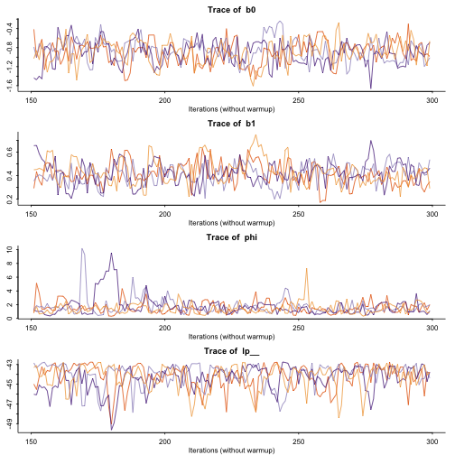
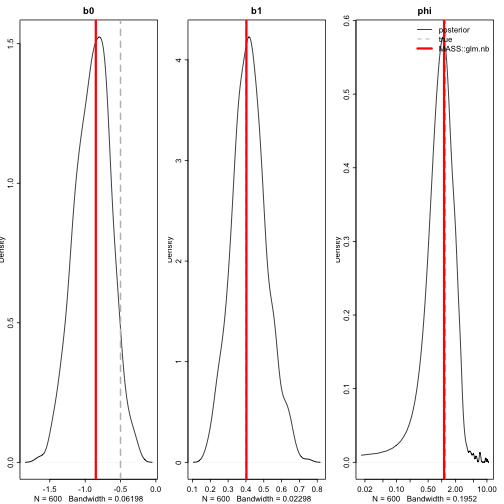
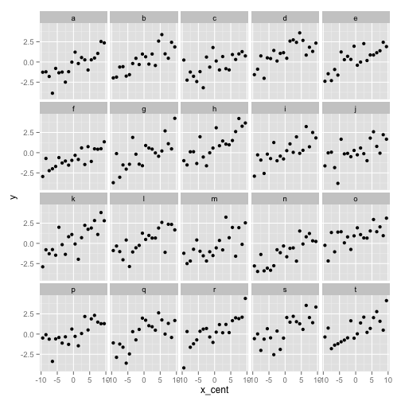
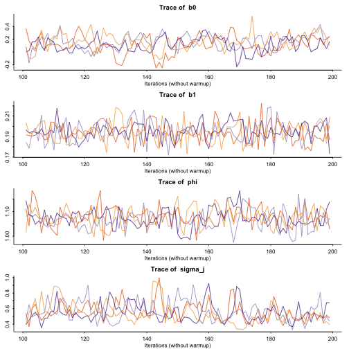
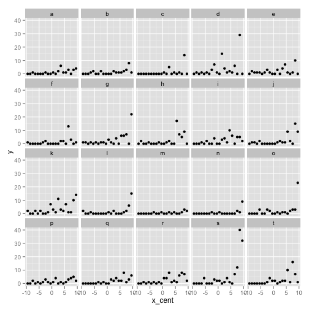
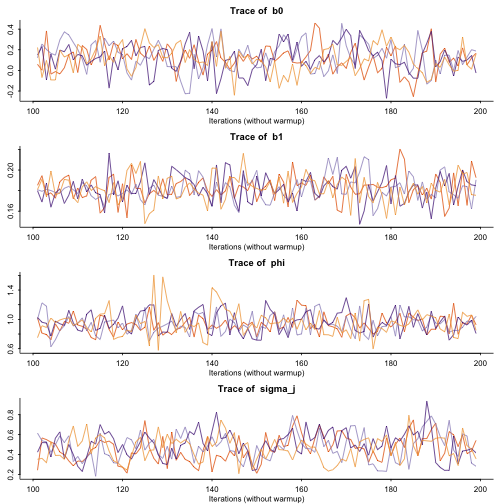

Compile the model:


```r
model <- "
// negative binomial parameterized as eta (log(mu)) and dispersion (phi)
// see p286 in stan-reference-2.4.0.pdf
// a basic GLM example
data {
  int<lower=1> N;    // rows of data
  vector[N] x;       // predictor
  int<lower=0> y[N]; // response
}
parameters {
  real<lower=0> phi; // neg. binomial dispersion parameter
  real b0;  // intercept
  real b1;  // slope
}
model {
  // priors:
  phi ~ cauchy(0, 3);
  b0 ~ normal(0, 5);
  b1 ~ normal(0, 5);
  // data model:
  y ~ neg_binomial_2_log(b0 + b1 * x, phi);
}
"
sm <- stan_model(model_code = model)
```

```
## 
## TRANSLATING MODEL 'model' FROM Stan CODE TO C++ CODE NOW.
## COMPILING THE C++ CODE FOR MODEL 'model' NOW.
```

Simulate data:


```r
set.seed(123)
N <- 70
phi <- 1.2
b0 <- -0.5
b1 <- 0.4
x <- seq(1, 10, length.out = N)
y <- rnbinom(N, size = phi, mu = exp(b0 + (x - mean(x)) * b1))
plot(x, y)
```

 

Fit the model:


```r
library(parallel)
rng_seed  <- 1
sflist <-
  mclapply(1:4, mc.cores = 2,
    function(i) sampling(sm,
      data = list(N = N, y = y, x = x - mean(x)),
      pars = c("b0", "b1", "phi"),
      seed = rng_seed, iter = 300,
      chains = 1, chain_id = i,
      refresh = -1))
m <- sflist2stanfit(sflist)
```


```r
m
```

```
## Inference for Stan model: model.
## 4 chains, each with iter=300; warmup=150; thin=1; 
## post-warmup draws per chain=150, total post-warmup draws=600.
## 
##        mean se_mean   sd   2.5%    25%    50%    75%  97.5% n_eff Rhat
## b0    -0.89    0.02 0.25  -1.38  -1.07  -0.88  -0.71  -0.42   242 1.00
## b1     0.42    0.01 0.10   0.23   0.35   0.42   0.48   0.63   226 1.01
## phi    1.62    0.09 1.13   0.48   0.95   1.37   1.99   4.60   156 1.03
## lp__ -44.27    0.09 1.23 -47.33 -44.87 -43.96 -43.34 -42.83   178 1.02
## 
## Samples were drawn using NUTS(diag_e) at Sun Oct 19 18:22:33 2014.
## For each parameter, n_eff is a crude measure of effective sample size,
## and Rhat is the potential scale reduction factor on split chains (at 
## convergence, Rhat=1).
```

Plot the output:


```r
rstan::traceplot(m, inc_warmup = FALSE)
```

 

```r
e <- extract(m, pars = c("b0", "b1", "phi"))
true_pars <- c(b0 = b0, b1 = b1, phi = phi)
x_cent <- x - mean(x)
m_mass <- MASS::glm.nb(y ~ x_cent)
coefs_mass <- c(coef(m_mass), summary(m_mass)$theta)
par(mfrow = c(1, 3))
for(i in 1:3) {
  if(i %in% 1:2) {
    plot(density(e[[i]]), main = names(true_pars)[i])
  } else {
    plot(density(e[[i]]), main = names(true_pars)[i], log = "x")
  }
  abline(v = true_pars[i], lwd = 2, col = "grey", lty = 2)
  abline(v = coefs_mass[i], lwd = 3, col = "red")
}
```

```
## Warning: 13 x values <= 0 omitted from logarithmic plot
```

```r
legend("topright", legend = c("posterior", "true", "MASS::glm.nb"),
  col = c("black", "grey", "red"), lty = c(1, 2, 1), lwd = c(1, 1.3, 3),
  bty = "n")
```

 


```r
plot(x, y)
for(i in seq_along(e[[1]])) {
  lines(x, exp(e[[1]][i] + e[[2]][i] * (x - mean(x))), col = "#00000008")
}
```

 

## Adding a multilevel intercept

We'll start with a basic mixed effects model with a normal error distribution just to make sure we have this right.

We'll simulate some data with levels `j` that vary with standard deviation `sigma_j`. The deviations will be called `b0_j`.


```r
set.seed(1)
N <- 20
sigma_j <- 0.6
d <- data.frame(j = 1:20, jname = letters[1:20], 
  b0_j = rnorm(20, 0, sigma_j))
phi <- 1.1
b0 <- 0
b1 <- 0.2
ar1 <- 0.7
x <- seq_len(N)
x_cent <- x - mean(x)
dat <- list()
for(j in d$j) {
  dat[[j]] <- data.frame(j = j, jname = d$jname[j], x = x, 
    x_cent = x_cent, y = rnorm(N, sd = phi, 
      mean = b0 + d$b0_j[j] + x_cent * b1))
}
dat <- do.call("rbind", dat)
library(ggplot2)
ggplot(dat, aes(x_cent, y)) + geom_point() + facet_wrap(~jname)
```

 

Compile the model:


```r
model <- "
// with a multilevel intercept
// using Matt trick
data {
  int<lower=1> N;    // rows of data
  vector[N] x;       // predictor
  vector[N] y; // response
  int<lower=1> N_j;   // number of groups
  int<lower=1,upper=N_j> j_id[N];  // group ids
}
parameters {
  real<lower=0> phi;    // neg. binomial dispersion parameter
  real b0;              // intercept
  real b1;              // slope
  real<lower=0> sigma_j; // group-level standard deviation
  vector[N_j] e_b0_j;
}
transformed parameters {
  vector[N] yhat;
  vector[N_j] b0_j;     // group-level deviates

  b0_j <- sigma_j * e_b0_j;    // Matt trick
  for (i in 1:N) {
    yhat[i] <- b0 + b0_j[j_id[i]] + b1 * x[i];
  }
}
model {
  e_b0_j ~ normal(0,1); // Matt trick

  // priors:
  phi ~ cauchy(0, 3);
  b0 ~ normal(0, 5);
  b1 ~ normal(0, 5);
  sigma_j ~ cauchy(0, 2);

  y ~ normal(yhat, phi);
}
"
sm2 <- rstan::stan_model(model_code = model)
```

Fit the model:


```r
library(parallel)
rng_seed <- 123
model_data <-  list(
        N = nrow(dat),
        y = dat$y,
        x = dat$x_cent,
        N_j = max(dat$j),
        j_id = dat$j)
sflist <-
  mclapply(1:4, mc.cores = 2,
    function(i) sampling(sm2,
      data = model_data, pars = c("b0", "b1", "phi", "sigma_j", "b0_j"),
      seed = rng_seed, iter = 200,
      chains = 1, chain_id = i,
      refresh = -1))
m5 <- sflist2stanfit(sflist)
```


```r
traceplot(m5, inc_warmup = FALSE, pars = c("b0", "b1", "phi", "sigma_j"))
```

 

```r
m5
```

```
## Inference for Stan model: model.
## 4 chains, each with iter=200; warmup=100; thin=1; 
## post-warmup draws per chain=100, total post-warmup draws=400.
## 
##             mean se_mean   sd    2.5%     25%     50%     75%   97.5%
## b0          0.13    0.01 0.12   -0.12    0.05    0.13    0.22    0.38
## b1          0.19    0.00 0.01    0.18    0.19    0.19    0.20    0.21
## phi         1.07    0.00 0.04    1.00    1.04    1.07    1.10    1.15
## sigma_j     0.55    0.01 0.12    0.37    0.47    0.53    0.61    0.87
## b0_j[1]    -0.45    0.01 0.24   -0.89   -0.60   -0.45   -0.30    0.04
## b0_j[2]     0.10    0.01 0.24   -0.35   -0.06    0.10    0.24    0.60
## b0_j[3]    -0.43    0.01 0.22   -0.86   -0.57   -0.43   -0.28    0.00
## b0_j[4]     0.78    0.02 0.25    0.31    0.64    0.77    0.92    1.29
## b0_j[5]     0.16    0.01 0.25   -0.35   -0.01    0.16    0.34    0.66
## b0_j[6]    -0.72    0.02 0.24   -1.21   -0.87   -0.72   -0.57   -0.29
## b0_j[7]    -0.22    0.01 0.25   -0.71   -0.38   -0.22   -0.07    0.29
## b0_j[8]     0.70    0.02 0.24    0.27    0.52    0.69    0.85    1.17
## b0_j[9]     0.05    0.01 0.24   -0.42   -0.12    0.04    0.22    0.51
## b0_j[10]   -0.02    0.02 0.24   -0.52   -0.18   -0.03    0.14    0.43
## b0_j[11]    0.32    0.01 0.24   -0.17    0.17    0.32    0.51    0.76
## b0_j[12]    0.12    0.02 0.25   -0.36   -0.05    0.13    0.28    0.57
## b0_j[13]   -0.35    0.01 0.25   -0.82   -0.53   -0.36   -0.17    0.14
## b0_j[14]   -1.06    0.02 0.25   -1.56   -1.23   -1.07   -0.92   -0.56
## b0_j[15]    0.65    0.01 0.25    0.19    0.49    0.66    0.81    1.14
## b0_j[16]   -0.05    0.01 0.26   -0.51   -0.23   -0.06    0.12    0.45
## b0_j[17]   -0.11    0.01 0.25   -0.60   -0.28   -0.12    0.08    0.33
## b0_j[18]    0.22    0.02 0.25   -0.26    0.07    0.24    0.39    0.74
## b0_j[19]    0.38    0.01 0.24   -0.11    0.23    0.39    0.55    0.87
## b0_j[20]    0.34    0.01 0.23   -0.16    0.18    0.34    0.50    0.77
## lp__     -238.11    0.45 4.68 -247.71 -241.47 -237.81 -234.75 -229.79
##          n_eff Rhat
## b0         105 1.03
## b1         400 0.99
## phi        215 1.01
## sigma_j    151 1.04
## b0_j[1]    400 0.99
## b0_j[2]    400 1.01
## b0_j[3]    400 1.00
## b0_j[4]    211 1.00
## b0_j[5]    400 1.00
## b0_j[6]    249 1.00
## b0_j[7]    284 1.00
## b0_j[8]    217 1.01
## b0_j[9]    400 1.01
## b0_j[10]   258 1.01
## b0_j[11]   400 1.01
## b0_j[12]   240 1.02
## b0_j[13]   400 1.00
## b0_j[14]   233 1.00
## b0_j[15]   286 1.00
## b0_j[16]   400 1.00
## b0_j[17]   400 1.01
## b0_j[18]   219 1.01
## b0_j[19]   400 1.00
## b0_j[20]   255 1.00
## lp__       108 1.03
## 
## Samples were drawn using NUTS(diag_e) at Sun Oct 19 18:23:53 2014.
## For each parameter, n_eff is a crude measure of effective sample size,
## and Rhat is the potential scale reduction factor on split chains (at 
## convergence, Rhat=1).
```

```r
library(lme4)
```

```
## Loading required package: Matrix
```

```r
arm::display(lmer(y ~ x_cent + (1 | jname), data = dat))
```

```
## lmer(formula = y ~ x_cent + (1 | jname), data = dat)
##             coef.est coef.se
## (Intercept) 0.15     0.13   
## x_cent      0.19     0.01   
## 
## Error terms:
##  Groups   Name        Std.Dev.
##  jname    (Intercept) 0.51    
##  Residual             1.07    
## ---
## number of obs: 400, groups: jname, 20
## AIC = 1240, DIC = 1212
## deviance = 1222.1
```

Looks about right.

## Now with a negative binomial response

Simulate some data:


```r
set.seed(1)
N <- 20
sigma_j <- 0.6
d <- data.frame(j = 1:20, jname = letters[1:20], 
  b0_j = rnorm(20, 0, sigma_j))
phi <- 1.1
b0 <- 0
b1 <- 0.2
ar1 <- 0.7
x <- seq_len(N)
x_cent <- x - mean(x)
dat <- list()
for(j in d$j) {
  dat[[j]] <- data.frame(j = j, jname = d$jname[j], 
    x = x, x_cent = x_cent,
  y = rnbinom(N, size = phi, 
    mu = exp(b0 + d$b0_j[j] + x_cent * b1)))
}
dat <- do.call("rbind", dat)
library(ggplot2)
ggplot(dat, aes(x_cent, y)) + geom_point() + facet_wrap(~jname)
```

 

Compile the multilevel intercept negative binomial GLMM model:


```r
model <- "
// with a multilevel intercept
// using Matt trick
data {
  int<lower=1> N;    // rows of data
  vector[N] x;       // predictor
  int<lower=0> y[N]; // response
  int<lower=1> N_j;   // number of groups
  int<lower=1,upper=N_j> j_id[N];  // group ids
}
parameters {
  real<lower=0> phi;    // neg. binomial dispersion parameter
  real b0;              // intercept
  real b1;              // slope
  real<lower=0> sigma_j; // group-level standard deviation
  vector[N_j] e_b0_j;
}
transformed parameters {
  vector[N] eta;
  vector[N_j] b0_j;     // group-level deviates

  b0_j <- sigma_j * e_b0_j;    // Matt trick
  for (i in 1:N) {
    eta[i] <- b0 + b0_j[j_id[i]] + b1 * x[i];
  }
}
model {
  e_b0_j ~ normal(0,1); // Matt trick

  // priors:
  phi ~ cauchy(0, 3);
  b0 ~ normal(0, 5);
  b1 ~ normal(0, 5);
  sigma_j ~ cauchy(0, 2);

  y ~ neg_binomial_2_log(eta, phi);
}
"
sm6 <- rstan::stan_model(model_code = model)
```

And fit the model:


```r
library(parallel)
rng_seed <- 123
model_data <-  list(
        N = nrow(dat),
        y = dat$y,
        x = dat$x_cent,
        N_j = max(dat$j),
        j_id = dat$j)
sflist2 <-
  mclapply(1:4, mc.cores = 2,
    function(i) sampling(sm6,
      data = model_data, pars = c("b0", "b1", "phi", "sigma_j", "b0_j"),
      seed = rng_seed, iter = 200,
      chains = 1, chain_id = i,
      refresh = -1))
m6 <- sflist2stanfit(sflist2)
```


```r
traceplot(m6, inc_warmup = FALSE, pars = c("b0", "b1", "phi", "sigma_j"))
```

 

```r
m6
```

```
## Inference for Stan model: model.
## 4 chains, each with iter=200; warmup=100; thin=1; 
## post-warmup draws per chain=100, total post-warmup draws=400.
## 
##            mean se_mean   sd   2.5%    25%    50%    75%  97.5% n_eff Rhat
## b0         0.12    0.01 0.13  -0.14   0.03   0.12   0.21   0.39   197 1.00
## b1         0.18    0.00 0.01   0.16   0.17   0.18   0.19   0.21   400 0.99
## phi        0.95    0.01 0.15   0.72   0.85   0.94   1.04   1.25   400 1.00
## sigma_j    0.48    0.01 0.13   0.24   0.39   0.48   0.56   0.74   154 1.04
## b0_j[1]   -0.27    0.02 0.28  -0.89  -0.44  -0.27  -0.09   0.25   347 1.02
## b0_j[2]   -0.23    0.02 0.31  -0.87  -0.44  -0.23  -0.03   0.38   400 1.01
## b0_j[3]   -0.41    0.02 0.33  -1.10  -0.64  -0.38  -0.20   0.22   374 0.99
## b0_j[4]    0.57    0.01 0.27   0.06   0.36   0.59   0.77   1.10   400 1.01
## b0_j[5]    0.19    0.01 0.25  -0.29   0.00   0.17   0.33   0.70   400 0.99
## b0_j[6]   -0.22    0.01 0.27  -0.75  -0.39  -0.23  -0.07   0.37   400 1.00
## b0_j[7]    0.23    0.01 0.28  -0.29   0.03   0.22   0.41   0.75   400 1.00
## b0_j[8]    0.11    0.01 0.24  -0.33  -0.05   0.10   0.28   0.60   400 1.00
## b0_j[9]    0.17    0.01 0.27  -0.36   0.00   0.17   0.32   0.68   400 1.00
## b0_j[10]   0.05    0.01 0.26  -0.50  -0.14   0.05   0.24   0.53   400 1.00
## b0_j[11]   0.53    0.01 0.25   0.05   0.36   0.53   0.70   1.01   400 1.00
## b0_j[12]  -0.23    0.01 0.29  -0.83  -0.40  -0.24  -0.05   0.27   400 1.00
## b0_j[13]  -0.72    0.02 0.37  -1.44  -0.98  -0.69  -0.45  -0.07   292 1.02
## b0_j[14]  -0.68    0.02 0.36  -1.42  -0.90  -0.68  -0.44   0.01   312 1.00
## b0_j[15]   0.02    0.01 0.28  -0.57  -0.16   0.04   0.19   0.54   400 1.01
## b0_j[16]  -0.01    0.01 0.27  -0.50  -0.21  -0.02   0.18   0.55   400 1.00
## b0_j[17]  -0.12    0.01 0.27  -0.66  -0.30  -0.12   0.07   0.37   400 1.00
## b0_j[18]   0.22    0.01 0.28  -0.27   0.03   0.20   0.39   0.85   400 1.00
## b0_j[19]   0.54    0.01 0.28   0.02   0.33   0.53   0.74   1.10   400 1.00
## b0_j[20]   0.17    0.01 0.28  -0.35  -0.02   0.18   0.36   0.72   400 0.99
## lp__     394.48    0.50 5.21 383.56 391.04 395.03 398.48 402.99   109 1.04
## 
## Samples were drawn using NUTS(diag_e) at Sun Oct 19 18:26:15 2014.
## For each parameter, n_eff is a crude measure of effective sample size,
## and Rhat is the potential scale reduction factor on split chains (at 
## convergence, Rhat=1).
```

```r
# library(glmmADMB)
# m6.glmmadmb <- glmmadmb(y ~ x_cent + (1 | jname), data = dat, family = "nbinom1")
# coef(m6.glmmadmb)
```
